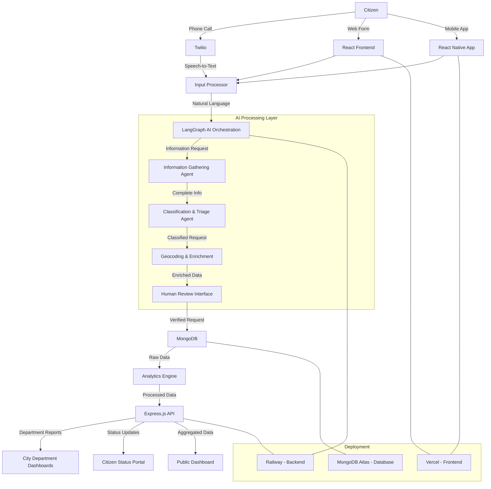

# 311 Service Requests using AI

## AI-Enhanced 311 Service Request System

City311AI is an intelligent civic infrastructure project that leverages AI to enhance traditional 311 non-emergency reporting systems. By combining natural language processing with geospatial analysis, this system aims to streamline how citizens report issues and how cities respond to them.



## 🌟 Features

- **Natural Language Processing**: Citizens can report issues in everyday language via phone or web
- **Intelligent Information Gathering**: AI conversational agents ensure all necessary details are collected
- **Automated Classification & Prioritization**: Issues are categorized and prioritized using AI
- **Geospatial Analysis**: Reports are geocoded and analyzed for patterns
- **Actionable Department Reports**: Generates specific reports for relevant city departments
- **Citizen Status Tracking**: Provides transparent updates to citizens about their reports

## 🔧 Technology Stack

### Frontend
- **Next.js**: React framework for the web interface
- **Tailwind CSS**: For responsive styling
- **Mapbox/Leaflet**: For map visualizations

### Backend
- **FastAPI**: Python-based API framework
- **LangGraph**: Orchestration for AI agents
- **LLM Integration**: OpenAI GPT-4o, Anthropic Claude 3.7 Sonnet, or Google Gemini 2.5 Pro
- **Twilio**: Phone call handling and voice interface
- **Supabase/PostgreSQL+PostGIS**: Database with geospatial capabilities

### Deployment
- **Railway**: Backend deployment platform
- **Vercel**: Frontend deployment platform

## 🏗️ System Architecture

### Component Flow

1. **Input Layer**: 
   - Citizens submit reports via phone call (Twilio) or web interface (Next.js)
   - Voice inputs are converted to text for processing

2. **AI Processing Layer**:
   - Information Gathering Agent ensures complete details (LangGraph + LLM)
   - Classification Agent categorizes and prioritizes issues (LangGraph + LLM)
   - Geocoding attaches precise location data (PostGIS)

3. **Analytics Layer**:
   - Aggregates related reports
   - Identifies patterns and hotspots
   - Assigns priority scores based on multiple factors

4. **Reporting Layer**:
   - Generates department-specific actionable reports
   - Updates citizens on request status
   - Creates public-facing dashboards for transparency


## Common Commands

```bash
# Navigate to the project root
cd "/Users/shg309/Dropbox (Personal)/Education/hks_cid_growth_lab/misc/311_service_requests"

# Install dependencies (using uv, NOT poetry)
uv sync

# Linting and formatting
uv run ruff check .                          # Run linter
uv run ruff format .                         # Format code

```

## Code Style Guidelines

- **Python**: 3.12+ with type hints required throughout the codebase
- **Package Management**: Use uv (not poetry), prioritize pyproject.toml
- **Architecture**: Maintain separation between backend and frontend components
- **Documentation**: Google-style docstrings
- **Formatting**: PEP 8, line length 88 characters, double quotes, use ruff
- **Imports**: Follow section order: standard-library → third-party → first-party → local-folder
- **Async**: Use async/await for I/O-bound operations and for LLM-related operations
- **Error Handling**: Implement comprehensive error handling with meaningful messages
- **Logging**: Use loguru with appropriate log levels for structured logging
- **Configuration**: YAML files for configuration, environment variables for secrets


## 📊 Data Models

### Service Request

The Service Request data model represents a citizen's report about a city issue. Key fields include:

- **ID**: Unique identifier for the request
- **Request Type**: Category of the issue (pothole, graffiti, broken streetlight, etc.)
- **Description**: Citizen's description of the problem
- **Location**: Geographic point data with latitude, longitude, address, neighborhood, city, state, and zip code information
- **Reporter ID**: Optional identifier for the reporting citizen
- **Priority**: Assigned urgency level (low, medium, high, critical)
- **Status**: Current state of resolution (new, in progress, resolved, closed, invalid)
- **Timestamps**: Creation and update times
- **Department**: City department assigned to resolve the issue
- **Media**: Optional images of the reported issue
- **AI Metadata**: Confidence score and human review status

### Department

The Department model represents city agencies that respond to service requests:

- **ID**: Unique identifier
- **Name**: Department name (Public Works, Transportation, etc.)
- **Contact**: Official email for department communications
- **Issue Types**: Categories of issues this department handles
- **Service Areas**: Geographic boundaries of responsibility

### Report

The Report model captures aggregated insights for city officials:

- **ID**: Unique identifier
- **Department ID**: Target department for this report
- **Title**: Report summary
- **Generated At**: Timestamp
- **Issues**: Collection of service requests included
- **Priority Summary**: Statistical breakdown of issues by priority
- **Hotspots**: Geographic clusters of related issues
- **Recommendations**: AI-generated suggested actions

## 🚀 Implementation Guide

### 1. Setup Environment

```bash
# Clone the repository
git clone https://github.com/shreyasgm/311-service-requests.git
cd 311-service-requests

# Setup Python environment
python -m venv venv
source venv/bin/activate  # On Windows: venv\Scripts\activate
pip install -r requirements.txt

# Setup frontend
cd frontend
npm install
```

### 2. Configuration

Create a `.env` file in the root directory with the following variables:

```
# LLM Configuration
OPENAI_API_KEY=your_api_key

# Twilio Configuration
TWILIO_ACCOUNT_SID=your_account_sid
TWILIO_AUTH_TOKEN=your_auth_token
TWILIO_PHONE_NUMBER=your_twilio_number

# Supabase Configuration
SUPABASE_URL=your_supabase_url
SUPABASE_ANON_KEY=your_supabase_key

# Railway Configuration (if needed)
RAILWAY_TOKEN=your_railway_token
```

### 3. Database Setup

Set up your Supabase instance:

1. Create a new project in Supabase
2. Enable PostGIS extension:
   - Go to SQL Editor
   - Run: `CREATE EXTENSION postgis;`
3. Create the necessary tables (use the migration script in `./backend/migrations/init.sql`)

### 4. Backend Implementation

#### 4.1 FastAPI Setup

The FastAPI backend should implement several key endpoints:

- **Create Service Request**: Accepts citizen reports and saves them to the database
- **Get Service Request**: Retrieves details about a specific report by ID
- **Update Service Request**: Updates status and other fields as a request progresses
- **List Service Requests**: Returns filtered lists of requests based on various criteria
- **Generate Department Report**: Creates aggregated reports for city departments

The API should use dependency injection for database access and implement proper error handling for various scenarios.

#### 4.2 LangGraph Agent Setup

The LangGraph AI orchestration should implement multiple agent types:

- **Information Gathering Agent**: Ensures all necessary details are collected from citizens
  - Asks follow-up questions when descriptions are vague
  - Confirms location details
  - Prompts for additional context when needed

- **Classification Agent**: Categorizes and prioritizes service requests
  - Determines request type from natural language description
  - Assigns appropriate priority level based on urgency and impact
  - Calculates confidence score for its determinations
  - Flags edge cases for human review

- **Geocoding Agent**: Enhances location data for better analysis
  - Converts text addresses to precise geographic coordinates
  - Identifies the relevant city district or neighborhood
  - Determines the responsible department based on location

Each agent should implement proper error handling and have fallback strategies for uncertain cases.

#### 4.3 Twilio Integration

The Twilio integration should handle the complete phone call workflow:

- **Initial Greeting**: Welcomes the caller and explains the purpose of the system
- **Speech Recognition**: Captures the citizen's description of the issue
- **Conversational Flow**: Uses AI agents to ask relevant follow-up questions
- **Confirmation**: Verifies understanding before finalizing the report
- **Status Provision**: Provides a tracking ID and completion confirmation

The integration should handle various edge cases like unclear speech, background noise, and disconnections gracefully.

### 5. Frontend Implementation

#### 5.1 Next.js Web Interface

The web interface should provide an intuitive user experience with several key pages:

- **Home Page**: Overview of the system with quick access to reporting and status checking
- **Report Form**: User-friendly form for submitting new service requests
- **Status Checker**: Tool for citizens to track their submitted reports
- **Public Dashboard**: Transparent view of citywide issues and resolution metrics

The interface should be responsive, accessible, and optimized for both desktop and mobile devices.

#### 5.2 Report Submission Flow

The report submission process should include:

- **Description Input**: Free-text field for issue description
- **Location Selection**: Address input with map confirmation
- **AI Classification**: Automatic categorization with user verification
- **Priority Assignment**: AI-suggested priority with ability to adjust
- **Contact Information**: Optional fields for follow-up communication
- **Media Upload**: Option to attach photos of the issue
- **Confirmation**: Clear summary before final submission
- **Tracking Information**: Provision of ID for future status checks

### 6. Deployment

#### 6.1 Railway Deployment

1. Create a new project in Railway
2. Connect your GitHub repository
3. Add environment variables from your `.env` file
4. Deploy the backend service

```bash
# Install Railway CLI
npm i -g @railway/cli

# Login to Railway
railway login

# Link to your project
railway link

# Deploy
railway up
```

#### 6.2 Vercel Deployment for Frontend

1. Connect your GitHub repository to Vercel
2. Configure build settings:
   - Build Command: `cd frontend && npm run build`
   - Output Directory: `frontend/.next`
3. Add environment variables
4. Deploy

## 🧪 Testing

### Unit Tests

```bash
# Run backend tests
cd backend
pytest

# Run frontend tests
cd frontend
npm test
```

### Integration Tests

Integration tests are in the `./tests` directory:

```bash
cd tests
pytest test_integration.py
```

### Manual Testing Scenarios

1. **Phone Call Flow**:
   - Call the Twilio number
   - Report: "There's a pothole on Main Street near the library"
   - Verify classification and follow-up questions
   - Confirm the system asks for additional details if needed
   - Check that a confirmation message is provided
   - Verify the report appears in the database with correct details

2. **Web Interface Flow**:
   - Submit a report through the web form
   - Verify AI classification matches the description
   - Check status using the tracking ID
   - Verify map visualization shows the report correctly positioned
   - Test different issue types to ensure proper categorization
   - Test edge cases with vague descriptions

## 🔍 AI Considerations

### Ethics & Bias

- The system should be regularly audited for bias in classification and prioritization
- Demographics data should be anonymized
- Geographic distribution of reports should be analyzed for underrepresentation

### Privacy

- Personal information is minimized in reports
- Contact details are optional and only used for status updates
- Location data is used only at the necessary precision level

### Human Oversight

- Requests with overall confidence below 0.7, validation confidence below 0.8, or classification confidence below 0.75 trigger human review
- Department staff can override AI classifications
- System logs all AI decisions for auditing purposes

## 🗺️ Roadmap

### Phase 1: MVP (current)
- Basic phone and web input
- AI classification and prioritization
- Simple reporting

### Phase 2: Enhanced Analytics
- Predictive service needs
- Historical trend analysis
- Resource allocation recommendations

### Phase 3: Community Features
- Citizen upvoting of issues
- Volunteer coordination
- Public transparency dashboard

## 📚 Resources

- [FastAPI Documentation](https://fastapi.tiangolo.com/)
- [LangGraph Documentation](https://langchain-ai.github.io/langgraph/)
- [Twilio Voice API Documentation](https://www.twilio.com/docs/voice)
- [PostGIS Documentation](https://postgis.net/documentation/)
- [Supabase Documentation](https://supabase.io/docs)

## 📝 License

MIT

## 👥 Contributing

Contributions are welcome! Please feel free to submit a Pull Request.

1. Fork the repository
2. Create your feature branch (`git checkout -b feature/amazing-feature`)
3. Commit your changes (`git commit -m 'Add some amazing feature'`)
4. Push to the branch (`git push origin feature/amazing-feature`)
5. Open a Pull Request